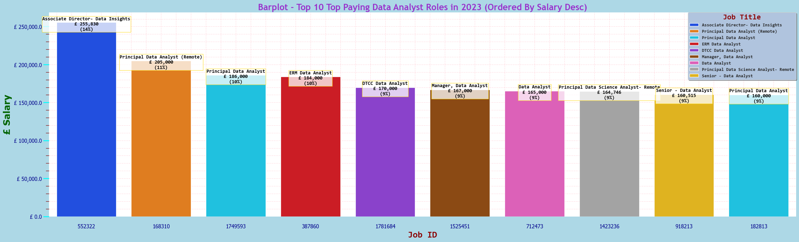
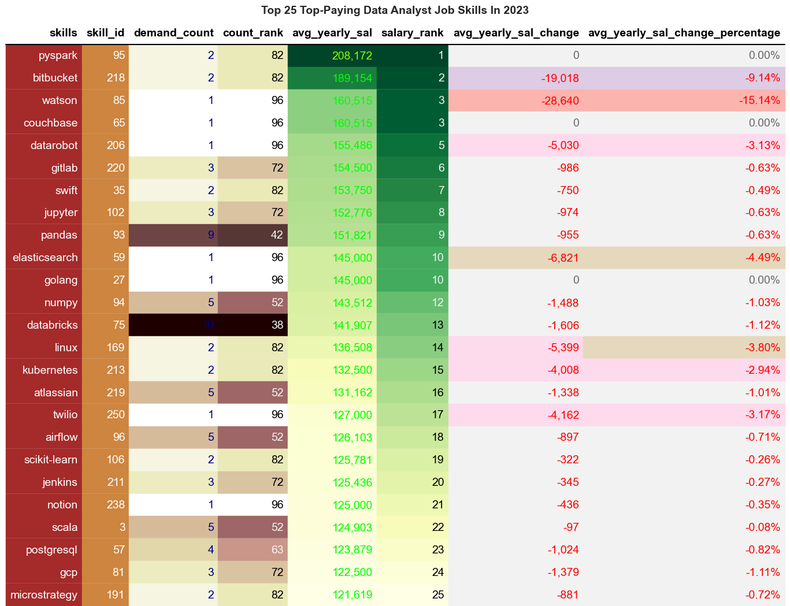
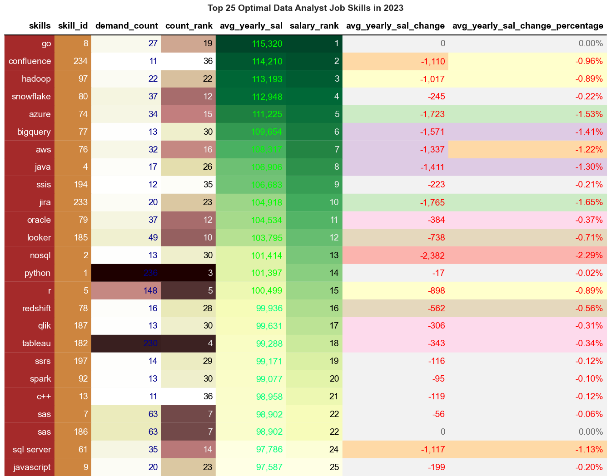

# Introduction 
📊 Dive into the data job market! Focusing on data analyst roles, this project explores 💰 top paying jobs, 🔥 in-demand skills and where 📈 high demand meets 🎆 💷 high salary in data analytics.

SQL queries? Check them out here: [sql_projects_folder](/SQL_Projects/PostgreSQL/Job_Data_Analysis/)

# Background
Driven by a quest to navigate the data analyst job market more effectively, this project was born from a desire to pinpoint top-paid and in-demand skills, streamlining others work to find optimal jobs.

### The questions i wanted to answer through my SQL queries were:

1. Wat are the top-paying data analyst jobs?
2. What skills are required for these top paying jobs?
3. What skills are most in demand for data analysts?
4. Which skills are associated with higher salaries?
5. What are the most optimal skills to learn?

# Tools I Used
For my deep dive into the data analyst job market, I harnessed the power of several key tools:

- **SQL**: The backbone of my analysis, allowing me to nquery the bdatabase and unearth critical insights.
- **PostgreSQL**: The chosen database management system, ideal for handling the job posting data.
- **Visual Studio Code**: My go-to for database management and executing SQL queries.
- **Git & Github**: Essential for version control and sharing my SQL scripts and analysis, ensuring collaboration and project tracking.


# The Analysis
Each query for this project aimed at investigating specific aspects of the data analyst job market.
Here's how I approached eaxch question:


### 1. 💰Top 10 Top-Paying Data Analyst Jobs In 2023[.sql](1_top_paying_jobs.sql)
To identify the highest-paying roles, I filtered data analyst positions by `average yearly salary` , `job health insurance` and `job_location`, focusing on `remote jobs`. 

*This query highlights the high paying jobs in the field.*

```sql
WITH top_paying_jobs AS(
  SELECT   
      cd.name AS company_name,
      jpf.job_posted_date::date AS date_job_posted,
      jpf.job_id,
      jpf.job_title,
      jpf.job_title_short,
      jpf.job_location,
      jpf.job_schedule_type,
      jpf.job_health_insurance,
      jpf.salary_year_avg,
      TO_CHAR(ROUND(jpf.salary_year_avg, 0),'FM999,999,999') AS formatted_salary,
      RANK() OVER (ORDER BY jpf.salary_year_avg DESC) AS salary_rank,
      CASE
          WHEN jpf.job_location = 'Anywhere' THEN 'Remote'
          ELSE 'Onsite'
      END AS location_category,
      CASE
          WHEN jpf.salary_year_avg > 600000 THEN 'Premium'
          WHEN jpf.salary_year_avg BETWEEN 400000 AND 600000 THEN 'High'
          WHEN jpf.salary_year_avg BETWEEN 200000 AND 400000 THEN 'Mid High'
          WHEN jpf.salary_year_avg BETWEEN 100000 AND 200000 THEN 'Mid'
          ELSE 'Low'
      END AS salary_quote
  FROM
      job_postings_fact AS jpf
  LEFT JOIN
      company_dim AS cd ON jpf.company_id = cd.company_id
  WHERE
      jpf.job_title_short = 'Data Analyst' AND
      jpf.job_location = 'Anywhere' AND
      jpf.job_health_insurance IS TRUE AND
      jpf.salary_year_avg IS NOT NULL
)
SELECT
  company_name,
  date_job_posted,
  job_id,
  job_title,
  job_health_insurance,
  location_category,
  formatted_salary,
  salary_quote,
  salary_rank
FROM
  top_paying_jobs
ORDER BY
  salary_year_avg DESC
LIMIT  
    10
```


*Generated using seaborn library*


*Generated using seaborn library*

### General Overview:
The table presents the Top 10 highest-paying Data Analyst roles in 2023, highlighting salary figures, company names, job titles, location category, and ranking based on compensation.

### Key Insights & Interpretations:

**Highest Paying Role:** Associate Director - Data Insights at AT&T (£255,830).
Predominantly Remote Jobs: All roles listed are remote, indicating flexibility in high-paying analyst jobs.

**Salary Distribution:** Salaries range from £160,000 to £255,830, showing a significant gap (~£95K) between the highest and lowest-paid roles.
Multiple Entries: SmartAsset and Get It Recruit - Information Technology appear multiple times, suggesting they are major recruiters in this space.

**Common Job Titles:** Principal Data Analyst, Data Analyst, and Senior Data Analyst appear frequently, emphasizing demand for experienced professionals.

### Trends & Implications:

**Remote Work is the Standard:** Employers are offering high salaries for remote positions, reflecting a shift in hiring models.

**Experience Matters:** Higher salaries are associated with senior and principal roles, reinforcing the need for expertise.

**Tech & Finance Dominate:** Companies like AT&T, Uber, Robert Half, and DIRECTV suggest telecom, fintech, and IT consulting are lucrative sectors.
Salary Ceiling is High: A top-tier Data Insights role pays over £250K, indicating room for career growth in analytics.

### Actionable Takeaways:

**Target Senior Positions:** Aspiring analysts should aim for Principal, Senior, and Associate Director roles for top-tier earnings.

**Emphasize Remote Readiness:** Build skills in virtual collaboration and remote data tools to remain competitive.

**Industry Focus:** Consider tech, finance, and consulting industries for higher salary prospects.

**Stay Competitive:** Upskill in advanced analytics, data science, and leadership to qualify for the highest-paid positions.

### 2. 💰Top 10 Top-Paying Data Analyst Skills In 2023[.sql](2_top_paying_job_skills.sql)
To identify the top-paying Skills for Data Analyst roles, I filtered data analyst positions by `salary_year_avg` , `job_health_insurance` & `job_location` focusing on `remote jobs`. 

*This query highlights the high paying skills in the field.*

```sql
WITH top_paying_job_skills AS(
    SELECT 
        cd.name AS company_name,
        jpf.job_posted_date::date AS date_job_posted,
        job_id,
        job_title
        job_location,
        job_schedule_type,
        job_health_insurance,
        TO_CHAR(ROUND(salary_year_avg, 0),'FM999,999,999') AS formatted_salary,
        RANK() OVER (ORDER BY salary_year_avg DESC) AS salary_rank,
        CASE
            WHEN jpf.job_location = 'Anywhere' THEN 'Remote'
            ELSE 'Onsite'
        END AS location_category,
        CASE
            WHEN salary_year_avg > 600000 THEN 'Premium'
            WHEN salary_year_avg BETWEEN 400000 AND 600000 THEN 'High'
            WHEN salary_year_avg BETWEEN 200000 AND 400000 THEN 'Mid High'
            WHEN salary_year_avg BETWEEN 100000 AND 200000 THEN 'Mid'
            ELSE 'Low'
        END AS salary_quote
    FROM
        job_postings_fact AS jpf
    LEFT JOIN
        company_dim AS cd ON jpf.company_id = cd.company_id
    WHERE
        job_title_short = 'Data Analyst' AND
        job_location = 'Anywhere' AND
        job_health_insurance IS TRUE AND
        salary_year_avg IS NOT NULL
    ORDER BY
        salary_year_avg DESC
    LIMIT  
        10
)
SELECT
top_paying_job_skills.*,
sd.skill_id,
skills
FROM 
    top_paying_job_skills
INNER JOIN 
    skills_job_dim AS sjd ON top_paying_job_skills.job_id = sjd.job_id
INNER JOIN 
    skills_dim AS sd ON sjd.skill_id = sd.skill_id;
```

### 3. 🔥Top 25 Demanded Data Analyst Skills In 2023[.sql](3_top_demanded_skills.sql)
To identify the top demanded Data Analyst Skills, I filtered Data Analyst positions by `salary_year_avg` & `job_working_from_home` and grouped by `skills` & `skill_id`.

*This query highlights the top demanded skills in the field.*

```sql
WITH top_demanded_skills AS(
    SELECT
    sd.skills AS skills,
    sd.skill_id AS skill_id,
    COUNT(sjd.job_id) AS demand_count,
    TO_CHAR(COUNT(sjd.job_id), 'FM999,999,999') AS formatted_count,
    AVG(jpf.salary_year_avg) AS avg_yearly_sal,
    TO_CHAR(ROUND(AVG(salary_year_avg), 0),'FM999,999,999') AS formatted_salary,
    RANK() OVER (ORDER BY (ROUND(COUNT(sjd.job_id)),0) DESC) AS count_rank,
    RANK() OVER (ORDER BY ROUND(AVG(jpf.salary_year_avg),0) DESC) AS salary_rank
    FROM 
        job_postings_fact AS jpf
    INNER JOIN 
        skills_job_dim AS sjd ON jpf.job_id = sjd.job_id
    INNER JOIN 
        skills_dim AS sd ON sjd.skill_id = sd.skill_id
    WHERE
        jpf.job_title_short = 'Data Analyst' AND
        jpf.job_work_from_home = TRUE AND
        jpf.salary_year_avg IS NOT NULL
    GROUP BY -- Use when aggregating (COUNT, SUM, AVG etc..)
        sd.skills,
        sd.skill_id
    ORDER BY
        demand_count DESC
        -- avg_yearly_sal DESC
)
SELECT
    skills,
    skill_id,
    formatted_count,
    formatted_salary,
    count_rank,
    salary_rank  
FROM
    top_demanded_skills
LIMIT
    25;
```

### Dataframe

*Generated using seaborn library*

### Barplot

*Generated using seaborn library*

### General Overview
This table presents the Top 25 Most Demanded Data Analyst Skills in 2023, ranking them by demand count, average yearly salary, and their relative positions in demand and salary rankings. The heatmap coloring helps visually differentiate the most in-demand and highest-paying skills.

### Key Insights & Interpretations

**Most Demanded Skills:**
SQL leads with 398 job postings, followed by Excel (256), Python (236), and Tableau (230), confirming their dominance in the data analytics field.
Power BI (110) and R (148) show strong demand, highlighting the importance of visualisation and statistical programming.

**Salary vs. Demand**
While SQL is the most in-demand skill, its salary rank is 62nd, meaning higher-paying skills exist despite lower demand.
Go (£115,320), Hadoop (£113,193), and Snowflake (£112,948) offer the highest salaries, indicating specialized tools can command premium wages.
Excel (256 job postings, £87,288) remains essential but has one of the lowest salary rankings (86th).
Word (£82,576) and SharePoint (£81,634) rank lowest in salary, reflecting their lesser value in analytics roles.

### Trends & Implications
SQL, Python, and Tableau remain fundamental in data analytics, ensuring strong job security.
Niche skills like Snowflake, Go, and Hadoop command higher salaries, indicating that cloud-based data solutions and big data expertise are lucrative.
Microsoft Office tools (Excel, Word, PowerPoint) still hold value but aren’t high earners, suggesting that analysts should supplement these with technical skills.
Cloud platforms (Azure, AWS) and data engineering skills (Hadoop, SQL Server) are gaining traction, making them excellent options for career growth.

### Actionable Takeaways
If aiming for high demand, focus on SQL, Excel, Python, and Tableau.
If prioritizing salary growth, consider specializing in Hadoop, Snowflake, Go, or cloud platforms like AWS/Azure.
Develop a combination of high-demand and high-paying skills for the best career prospects in data analytics.

### 4. 💰Top 25 Top-Paying Data Analyst Skills In 2023[.sql](4_top_paying_skills.sql)
To identify the top-paying Data Analyst Skills, I filtered data analyst positions by `salary_year_avg` & `job_working_from_home` and grouped by `skills` & `skill_id`.

*The query highlights the high paying skills in the field.*

```sql
WITH top_paying_skills AS(
    SELECT
        sd.skills AS skills,
        sd.skill_id AS skill_id,
        COUNT(sjd.job_id) AS demand_count,
        TO_CHAR(COUNT(sjd.job_id), 'FM999,999,999') AS formatted_count,
        ROUND(AVG(jpf.salary_year_avg),0) AS avg_yearly_sal,
        TO_CHAR(ROUND(AVG(salary_year_avg), 0),'FM999,999,999') AS formatted_salary,
        RANK() OVER (ORDER BY (ROUND(COUNT(sjd.job_id)),0) DESC) AS count_rank,
        RANK() OVER (ORDER BY ROUND(AVG(jpf.salary_year_avg),0) DESC) AS salary_rank
    FROM 
        job_postings_fact AS jpf
    INNER JOIN 
        skills_job_dim AS sjd ON jpf.job_id = sjd.job_id
    INNER JOIN 
        skills_dim AS sd ON sjd.skill_id = sd.skill_id
    WHERE
        jpf.job_title_short = 'Data Analyst' AND
        jpf.job_work_from_home = TRUE AND
        jpf.salary_year_avg IS NOT NULL
    GROUP BY -- Use when aggregating (COUNT, SUM, AVG etc..)
        sd.skills,
        sd.skill_id
    -- ORDER BY
    --     avg_yearly_sal DESC
)
SELECT
    skills,
    skill_id,
    formatted_count,
    formatted_salary,
    count_rank,
    salary_rank
FROM
    top_paying_skills
ORDER BY
    avg_yearly_sal DESC
LIMIT
    25;
```

### Dataframe

*Generated using seaborn library*

### Barplot

*Generated using seaborn library*

### General Overview:
The table lists the Top 25 highest-paying skills for Data Analysts in 2023, ranking them by average yearly salary, demand count, and count rank (popularity).

### Key Insights & Interpretations:
**Highest Paying Skill:** PySpark leads with an average salary of £208,172, followed by Bitbucket (£189,154).

Rare Yet Lucrative Skills: Couchbase, Watson, and DataRobot pay over £150K+ but have low demand, indicating niche expertise.

Popular but Mid-Tier Pay: Pandas (9 demand count, £151,821) and Databricks (10 demand count, £141,907) are highly in demand yet offer relatively lower pay.

**Big Data & Cloud Dominate:** PySpark, Elasticsearch, Kubernetes, Databricks, GCP, and PostgreSQL highlight the importance of big data & cloud skills.
AI & ML in the Mix: Watson, Scikit-learn, and DataRobot indicate AI/ML skills command high salaries.

### Trends & Implications:
High-Paying Skills Aren't Always Popular: The highest salaries often belong to rare, specialized skills (PySpark, Bitbucket, Couchbase).

**Big Data & Cloud are Essential:** Companies highly value data engineering, distributed computing, and cloud platforms.

**Python Ecosystem Still Dominant:** Jupyter, Pandas, Numpy, and Scikit-learn are staples for analysts but rank lower in salary.

**Full-Stack Data Skills Pay Well:** Elasticsearch, Kubernetes, Jenkins, and PostgreSQL suggest a shift towards data infrastructure & engineering roles.

### Actionable Takeaways:

**Master Niche Technologies:** Specializing in PySpark, Bitbucket, or AI-driven platforms can unlock six-figure salaries.

**Go Beyond Python Basics:** Pair Pandas & Numpy with PySpark, Databricks, and cloud-based data processing to boost earning potential.

**Invest in Cloud & DevOps:** Kubernetes, Jenkins, GCP, and PostgreSQL show increasing relevance for data professionals.

**Stay Ahead with AI & ML:** Knowledge of Watson, Scikit-learn, and DataRobot could future-proof your career

### 5. 🔥📈🟰⚡💰Top 25 Optimal Data Analyst Skills In 2023[.sql](5_optimal_skills.sql)
To identify the optimal Data Analyst Skills, I filtered data analyst positions by `salary_year_avg` & `job_working_from_home` and grouped by `skills` & `skill_id`

*The query highlights the high demand & high paying skills in the field.*

```sql
WITH optimal_skills AS(
    SELECT
        sd.skills AS skills,
        sd.skill_id AS skill_id,
        COUNT(sjd.job_id) AS demand_count,
        TO_CHAR(COUNT(sjd.job_id), 'FM999,999,999') AS formatted_count,
        ROUND(AVG(jpf.salary_year_avg),0) AS avg_yearly_sal,
        TO_CHAR(ROUND(AVG(salary_year_avg), 0),'FM999,999,999') AS formatted_salary,
        RANK() OVER (ORDER BY (ROUND(COUNT(sjd.job_id)),0) DESC) AS count_rank,
        RANK() OVER (ORDER BY ROUND(AVG(jpf.salary_year_avg),0) DESC) AS salary_rank
    FROM 
        job_postings_fact AS jpf
    INNER JOIN 
        skills_job_dim AS sjd ON jpf.job_id = sjd.job_id
    INNER JOIN 
        skills_dim AS sd ON sjd.skill_id = sd.skill_id
    WHERE
        jpf.job_title_short = 'Data Analyst' AND
        jpf.job_work_from_home = TRUE AND
        jpf.salary_year_avg IS NOT NULL
    GROUP BY -- Use when you aggregate (COUNT, SUM, AVG etc..)
        sd.skills,
        sd.skill_id
    HAVING
        COUNT(sjd.job_id) > 10 -- Optimal skills filter
)
SELECT
    skills,
    skill_id,
    formatted_count,
    formatted_salary,
    count_rank,
    salary_rank
FROM
    optimal_skills
-- WHERE
--     demand_count > 10 -- Optimal skills filter
ORDER BY
    avg_yearly_sal DESC
    
LIMIT
    25;
```

### Dataframe

*Generated using seaborn library*

### Barplot

*Generated using seaborn library*

### General Overview
This visualisation presents the top 25 optimal Skills for data analysts in 2023, ranked based on their demand count, average yearly salary, and overall ranking metrics. The table includes key skills such as Python, SQL, Hadoop, and AWS, displaying their demand in the job market alongside their earning potential. A heatmap-style color gradient is used to highlight variations, with darker green shades indicating higher salaries, while red and brown shades emphasize high demand but relatively lower salaries in comparison.

### Key Insights & Interpretations
From the visualisation, skills like Go, Confluence, and Hadoop rank highest in terms of salary, earning over £113,000 per year on average. However, the most in-demand skills, such as Python (236 demand count) and Tableau (230 demand count), do not rank as highly in salary, suggesting that while they are essential, their high supply keeps wages competitive. Interestingly, specialized skills like SAS (63 demand count) and SSIS (12 demand count) show moderate demand but relatively good salary rankings. This indicates that niche expertise can still yield strong compensation.

### Trends & Implications
The data suggests that while commonly used data analyst skills like Python, R, and SQL Server are widely required, emerging or less mainstream skills like Go and Confluence are commanding the highest salaries. This could indicate that companies are willing to pay more for expertise in newer or less common tools. Additionally, while some tools like Jira and Looker have decent demand and salary prospects, they may be complementary rather than primary analytical skills. This visualisation helps job seekers and professionals prioritize skill development based on a balance of demand and earning potential.

# What I Learned

Throughout this adventure, I've turbocharged my SQL toolkit with some serious firepower:

- **🧩 Complex Query Crafting:** Mastered the art of advanced SQL, merging tables like a pro and wielding `WITH` clauses for ninja-level temp table manoeuvres.
- **📊 Data Aggregation:** Got cozy with `GROUP BY` and turned aggregate functions like `COUNT()` and `AVG()` into my data-summarising sidekicks.
- **💡Analystical Wizardry:** Leveled up my real-world puzzle solving skills, turning questions into actionable, insightful SQL queries.

# Conclusions

### Insights
From the analysis, several insights emerged:

1. **Top-Paying Data Analyst Jobs:** Text TBC...........
2. **Skills for Top-Paying Jobs:** Text TBC.............
3.  **Top Demanded Skills for Data Analyst Jobs:** SQL, Python, and Tableau dominate demand, while Go, Hadoop, and Snowflake lead in salary potential.
Traditional skills like Excel and PowerPoint are widely required but offer lower pay, emphasizing the need for specialisation.
Cloud platforms (AWS, Azure) and data engineering tools (Snowflake, Hadoop) are emerging as lucrative career paths in data analytics.
4.  **Top-Paying skills for Data Analyst Jobs:** Text TBC
5.  **Most Optimal Skills To Learn for Top-Paying Data Analyst jobs:** While Python and Tableau have the highest demand, specialized skills like Go and Confluence command the highest salaries. The insights suggest that emerging or niche skills can offer better compensation, while widely used tools remain essential but more competitive in pay.


### Closing Thoughts
This project enhanced my SQL skills and provided valuable insights into the data analyst job market. The findings from the analysis serve as a guid to prioritising skill development and job search efforts. Aspiring data analysts can better position themselves in a competitivve job market by focusing on high-demand, high-salary skills. This exploration highlights the importaance of continuous learning and adaptation to emerging trends inthe field of data analytics.
