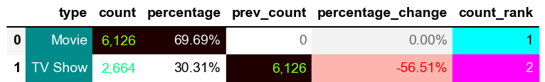
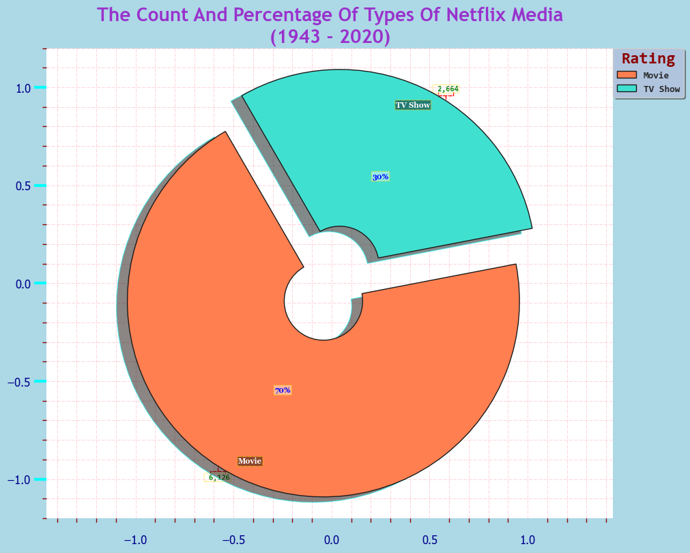

# Introduction 
TBC.

SQL queries? Check them out here: [sql_projects_folder](/SQL_Projects/)

# Background
TBC.

### The questions i wanted to answer through my SQL queries were:

1. TBC?
2. TBC?
3. TBC?
4. TBC?
5. TBC?
6. TBC?
7. TBC?
8. TBC?
9. TBC?
10. TBC?


# Tools I Used
For my deep dive into the Netflix Media Market, I harnessed the power of several key tools:

- **SQL**: The backbone of my analysis, allowing me to query the database and unearth critical insights.
- **PostgreSQL**: The chosen database management system, ideal for handling the job posting data.
- **Visual Studio Code**: My go-to for database management and executing SQL queries.
- **Git & Github**: Essential for version control and sharing my SQL scripts and analysis, ensuring collaboration and project tracking.


# The Analysis
Each query for this project aimed at investigating specific aspects of the Netflix Media.
Here's how I approached each question:


### 1. 🔢The Count, 💯Percentage, ⏳Previous Count, 📈📉Percentage Change & 🏅Count Rank Of Types Of Netflix Media[.sql](1_The_Count_And_Percentage_Of_Types_Of_Netflix_Media.sql)
To identify the Count, Percentage, Previous Count, Percentage Change & Count Rank Of The Types Of Netflix Media filtered, I used `COUNT`, `GROUP BY`, `LAG` and `DENSE_RANK`.

*This query highlights the types of Netflix Media.*

```sql
WITH movie_type AS (
    SELECT
        type,
        COUNT(type) AS count --(*) counts all rows in a table, including rows with NULL values.
    FROM 
        netflix_data
    --WHERE
        --type
        --AND
        --director
        --AND
        --country
    GROUP BY 
        type
),
count_formatted AS (
    SELECT
        type,
        count,
        TO_CHAR(count, 'FM999,999,999') AS formatted_count,
        ROUND((count * 100.0) / SUM(count) OVER (), 2) AS percentage
        --RANK() OVER (ORDER BY count DESC) AS count_rank
    FROM 
        movie_type
    --ORDER BY 
        --count ASC
        --count DESC
)
--SELECT
    --type,
    --count,
    --ROUND((count * 100.0) / SUM(count) OVER (), 2) AS percentage
    --RANK() OVER (ORDER BY count DESC) AS count_rank
SELECT
    type,
    count,
    ROUND((count * 100.0) / SUM(count) OVER (), 2) AS percentage,
    COALESCE(LAG(count) OVER (ORDER BY count DESC), 0) AS prev_count,  -- Replacing NULL with 0,
    CASE 
        WHEN LAG(count) OVER (ORDER BY count DESC) IS NOT NULL 
        THEN ROUND(((count - LAG(count) OVER (ORDER BY count DESC)) * 100.0) / LAG(count) OVER (ORDER BY count DESC), 2)
        ELSE 0
    END AS percentage_change,
    DENSE_RANK() OVER (ORDER BY count DESC) AS count_rank
FROM 
    count_formatted
ORDER BY
    --count ASC 
    count DESC
```

### Dataframe

*Generated using seaborn library*

### Pie Chart

*Generated using seaborn library*


### General Overview:


### Key Insights & Interpretations:

**TBC:** 

**TBC:** 

**TBC:**


### Trends & Implications:

**TBC:**

**TBC:** 

**TBC:**


### Actionable Takeaways:

**TBC:**

**TBC:**

**TBC:** 

**TBC:**


# What I Learned

Throughout this adventure, I've turbocharged my SQL toolkit with some serious firepower:

- **🧩 Complex Query Crafting:** Mastered the art of advanced SQL, merging tables like a pro and wielding `WITH` clauses for ninja-level temp table manoeuvres.
- **📊 Data Aggregation:** Got cozy with `GROUP BY` and turned aggregate functions like `COUNT()` and `AVG()` into my data-summarising sidekicks.
- **💡Analystical Wizardry:** Leveled up my real-world puzzle solving skills, turning questions into actionable, insightful SQL queries.

# Conclusions


### Insights
From the analysis, several insights emerged:

1. **TBC:** TBC.
2. **TBC:** TBC.
3. **TBC:** TBC.
4. **TBC:** TBC.
5. **TBC:** TBC.


### Closing Thoughts
TBC.
