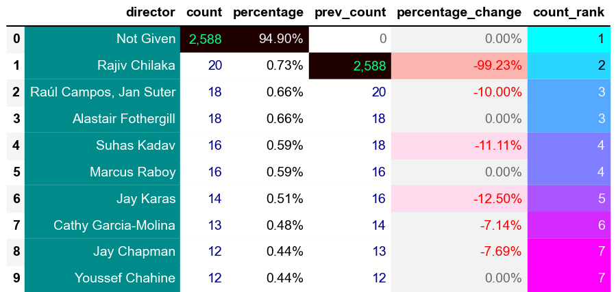

# Introduction 
TBC.

SQL queries? Check them out here: [sql_projects_folder](/SQL_Projects/)

# Background
TBC.

### The questions i wanted to answer through my SQL queries were:

1. What are the types of Netflix Media?
2. What are the Top 10 Directors?
3. What is the proportion Of Directors With Name Given And Name Not Given?
4. What are the Top 10 Directors excluding director Not Given?
5. What are the Top 10 Days (LIMIT 10 was used for continuity. I know there are only 7 days!😂)?
6. TBC?
7. TBC?
8. TBC?
9. TBC?
10. TBC?


# Tools I Used
For my deep dive into the Netflix Media Market, I harnessed the power of several key tools:

- **SQL**: The backbone of my analysis, allowing me to query the database and unearth critical insights.
- **PostgreSQL**: The chosen database management system, ideal for handling the job posting data.
- **Visual Studio Code**: My go-to for database management and executing SQL queries.
- **Git & Github**: Essential for version control and sharing my SQL scripts and analysis, ensuring collaboration and project tracking.


# The Analysis
Each query for this project aimed at investigating specific aspects of the Netflix Media.
Here's how I approached each question:


### 1. 🔢The Count, 💯Percentage, ⏳Previous Count, 📈📉Percentage Change & 🏅Count Rank Of The Types Of Netflix Media[.sql](1_The_Count_And_Percentage_Of_Types_Of_Netflix_Media.sql)
To identify the Count, Percentage, Previous Count, Percentage Change & Count Rank the following functions were used: `COUNT`, `GROUP BY`, `LAG` and `DENSE_RANK`.

*This query highlights the types of Netflix Media.*

```sql
WITH movie_type AS (
    SELECT
        type,
        COUNT(type) AS count --(*) counts all rows in a table, including rows with NULL values.
    FROM 
        netflix_data
    --WHERE
        --type
        --AND
        --director
        --AND
        --country
    GROUP BY 
        type
),
count_formatted AS (
    SELECT
        type,
        count,
        TO_CHAR(count, 'FM999,999,999') AS formatted_count,
        ROUND((count * 100.0) / SUM(count) OVER (), 2) AS percentage
        --RANK() OVER (ORDER BY count DESC) AS count_rank
    FROM 
        movie_type
    --ORDER BY 
        --count ASC
        --count DESC
)
--SELECT
    --type,
    --count,
    --ROUND((count * 100.0) / SUM(count) OVER (), 2) AS percentage
    --RANK() OVER (ORDER BY count DESC) AS count_rank
SELECT
    type,
    count,
    ROUND((count * 100.0) / SUM(count) OVER (), 2) AS percentage,
    COALESCE(LAG(count) OVER (ORDER BY count DESC), 0) AS prev_count,  -- Replacing NULL with 0,
    CASE 
        WHEN LAG(count) OVER (ORDER BY count DESC) IS NOT NULL 
        THEN ROUND(((count - LAG(count) OVER (ORDER BY count DESC)) * 100.0) / LAG(count) OVER (ORDER BY count DESC), 2)
        ELSE 0
    END AS percentage_change,
    DENSE_RANK() OVER (ORDER BY count DESC) AS count_rank
FROM 
    count_formatted
ORDER BY
    --count ASC 
    count DESC
```

### Dataframe

*Generated using pandas library*

### Pie Chart

*Generated using seaborn library*

### General Overview:


### Key Insights & Interpretations:

**TBC:** 

**TBC:** 

**TBC:**


### Trends & Implications:

**TBC:**

**TBC:** 

**TBC:**


### Actionable Takeaways:

**TBC:**

**TBC:**

**TBC:** 

**TBC:**


### 2. 🔢The Count, 💯Percentage, ⏳Previous Count, 📈📉Percentage Change & 🏅Count Rank Of The Top 10 Directors[.sql](2_Top_10_Directors.sql)
To identify the Count, Percentage, Previous Count, Percentage Change & Count Rank the following functions were used: `COUNT`, `GROUP BY`, `LAG` and `DENSE_RANK`.

*This query highlights the Top 10 Directors.*

```sql
WITH directors AS (
    SELECT
        director,
        COUNT(director) AS count --(*) counts all rows in a table, including rows with NULL values.
    FROM 
        netflix_data
    --WHERE
        --type
        --AND
        --director
        --AND
        --country
    GROUP BY 
        director
),
top_10 AS (
    SELECT
        director,
        count
    FROM 
        directors
    ORDER BY
        count DESC
    LIMIT 10
)
--SELECT
    --director,
    --count,
    --ROUND((count * 100.0) / SUM(count) OVER (), 2) AS percentage
    --RANK() OVER (ORDER BY count DESC) AS count_rank
SELECT
    director,
    count,
    ROUND((count * 100.0) / SUM(count) OVER (), 2) AS percentage,
    COALESCE(LAG(count) OVER (ORDER BY count DESC), 0) AS prev_count,  -- Replacing NULL with 0,
    CASE 
        WHEN LAG(count) OVER (ORDER BY count DESC) IS NOT NULL 
        THEN ROUND(((count - LAG(count) OVER (ORDER BY count DESC)) * 100.0) / LAG(count) OVER (ORDER BY count DESC), 2)
        ELSE 0
    END AS percentage_change,
    DENSE_RANK() OVER (ORDER BY count DESC) AS count_rank
FROM 
    top_10
--ORDER BY 
    --count DESC
```

### Dataframe

*Generated using pandas library*

### General Overview:


### Key Insights & Interpretations:

**TBC:** 

**TBC:** 

**TBC:**


### Trends & Implications:

**TBC:**

**TBC:** 

**TBC:**


### Actionable Takeaways:

**TBC:**

**TBC:**

**TBC:** 

**TBC:**


### 3. 🔢The Count, 💯Percentage, ⏳Previous Count, 📈📉Percentage Change & 🏅Count Rank Of Director Name Given And Name Not Given[.sql](3_Director_Name_Given_And_Name_Not_Given.sql)
To identify the Count, Percentage, Previous Count, Percentage Change & Count Rank the following functions were used: `COUNT`, `GROUP BY`, `LAG` and `DENSE_RANK`.

*This query highlights Director Name Given And Name Not Given.*

```sql
WITH director_name AS (
    SELECT
        CASE
            WHEN director = 'Not Given' THEN 'Name Not Given'
            ELSE 'Name Given'
        END AS director_formatted,
        COUNT(director) AS count --(*) counts all rows in a table, including rows with NULL values.
    FROM 
        netflix_data
    --WHERE
        --type
        --AND
        --director
        --AND
        --country
    GROUP BY
        director_formatted
),
count_formatted AS (
    SELECT
        director_formatted,
        count,
        TO_CHAR(count, 'FM999,999,999') AS formatted_count,
        ROUND((count * 100.0) / SUM(count) OVER (), 2) AS percentage,
        RANK() OVER (ORDER BY count DESC) AS count_rank
    FROM 
        director_name
    --ORDER BY 
        --count ASC
        --count DESC
)
--SELECT
    --director_formatted,
    --count,
    --formatted_count,
    --percentage,
    --count_rank
SELECT
    director_formatted,
    count,
    --formatted_count
    ROUND((count * 100.0) / SUM(count) OVER (), 2) AS percentage,
    COALESCE(LAG(count) OVER (ORDER BY count DESC), 0) AS prev_count,  -- Replacing NULL with 0,
    CASE 
        WHEN LAG(count) OVER (ORDER BY count DESC) IS NOT NULL 
        THEN ROUND(((count - LAG(count) OVER (ORDER BY count DESC)) * 100.0) / LAG(count) OVER (ORDER BY count DESC), 2)
        ELSE 0
    END AS percentage_change,
    DENSE_RANK() OVER (ORDER BY count DESC) AS count_rank
FROM 
    count_formatted
ORDER BY
    --count ASC
    count DESC
```

### Dataframe

*Generated using pandas library*

### Pie Chart

*Generated using seaborn library*

### General Overview:


### Key Insights & Interpretations:

**TBC:** 

**TBC:** 

**TBC:**


### Trends & Implications:

**TBC:**

**TBC:** 

**TBC:**


### Actionable Takeaways:

**TBC:**

**TBC:**

**TBC:** 

**TBC:**


### 4. 🔢The Count, 💯Percentage, ⏳Previous Count, 📈📉Percentage Change & 🏅Count Rank Of The Top 10 Directors excluding director Not Given[.sql](4_Top_10_Directors_Excluding_director_Not_Given.sql)
To identify the Count, Percentage, Previous Count, Percentage Change & Count Rank the following functions were used: `COUNT`, `GROUP BY`, `LAG` and `DENSE_RANK`.

*This query highlights The Top 10 Directors excluding director Not Given.*

```sql
WITH directors_ng AS (
    SELECT
        director,
        COUNT(director) AS count --(*) counts all rows in a table, including rows with NULL values.
    FROM 
        netflix_data
    WHERE
        director NOT IN ('Not Given') -- <> '' can be used too.
        --type
        --AND
        --director
        --AND
        --country
    GROUP BY 
        director
),
top_10 AS (
    SELECT
        director,
        count
    FROM 
        directors_ng
    ORDER BY 
        count DESC
    LIMIT 10
)
--SELECT
    --director,
    --count,
    --ROUND((count * 100.0) / SUM(count) OVER (), 2) AS percentage
    --RANK() OVER (ORDER BY count) AS count_rank
SELECT
    director,
    count,
    ROUND((count * 100.0) / SUM(count) OVER (), 2) AS percentage,
    COALESCE(LAG(count) OVER (ORDER BY count DESC), 0) AS prev_count,  -- Replacing NULL with 0,
    CASE 
        WHEN LAG(count) OVER (ORDER BY count DESC) IS NOT NULL 
        THEN ROUND(((count - LAG(count) OVER (ORDER BY count DESC)) * 100.0) / LAG(count) OVER (ORDER BY count DESC), 2)
        ELSE 0
    END AS percentage_change,
    DENSE_RANK() OVER (ORDER BY count DESC) AS count_rank
FROM 
    top_10
--ORDER BY 
    --count DESC
```

### Dataframe
.png)
*Generated using pandas library*

### Bar Plot

*Generated using seaborn library*

### General Overview:


### Key Insights & Interpretations:

**TBC:** 

**TBC:** 

**TBC:**


### Trends & Implications:

**TBC:**

**TBC:** 

**TBC:**


### Actionable Takeaways:

**TBC:**

**TBC:**

**TBC:** 

**TBC:**


### 5. 🔢The Count, 💯Percentage, ⏳Previous Count, 📈📉Percentage Change & 🏅Count Rank Of The Top 10 Days[.sql](/SQL_Projects/PostgreSQL/SQL_Projects/Netflix_Data_Analysis/5_Top_10_Days.sql)
To identify the Count, Percentage, Previous Count, Percentage Change & Count Rank the following functions were used: `COUNT`, `GROUP BY`, `LAG` and `DENSE_RANK`.

*This query highlights The Top 10 Days.*

```sql
WITH release_days AS (
    SELECT
        TO_CHAR(date_added, 'FMDay') AS day,
        COUNT(*) AS count
    FROM 
        netflix_data
    --WHERE
        --type
        --AND
        --director
        --AND
        --country
    GROUP BY 
        day
),
top_10 AS (
    SELECT
        day,
        count
    FROM 
        release_days
    ORDER BY 
        count DESC
    LIMIT 10
)
SELECT
    day,
    count,
    ROUND((count * 100.0) / SUM(count) OVER (), 2) AS percentage,
    COALESCE(LAG(count) OVER (ORDER BY 
        CASE day
            WHEN 'Monday' THEN 1
            WHEN 'Tuesday' THEN 2
            WHEN 'Wednesday' THEN 3
            WHEN 'Thursday' THEN 4
            WHEN 'Friday' THEN 5
            WHEN 'Saturday' THEN 6
            WHEN 'Sunday' THEN 7
        END
    ), 0) AS prev_count,
    CASE 
        WHEN LAG(count) OVER (ORDER BY 
            CASE day
                WHEN 'Monday' THEN 1
                WHEN 'Tuesday' THEN 2
                WHEN 'Wednesday' THEN 3
                WHEN 'Thursday' THEN 4
                WHEN 'Friday' THEN 5
                WHEN 'Saturday' THEN 6
                WHEN 'Sunday' THEN 7
            END
        ) IS NOT NULL 
        THEN ROUND(((count - LAG(count) OVER (ORDER BY 
            CASE day
                WHEN 'Monday' THEN 1
                WHEN 'Tuesday' THEN 2
                WHEN 'Wednesday' THEN 3
                WHEN 'Thursday' THEN 4
                WHEN 'Friday' THEN 5
                WHEN 'Saturday' THEN 6
                WHEN 'Sunday' THEN 7
            END
        )) * 100.0) / LAG(count) OVER (ORDER BY 
            CASE day
                WHEN 'Monday' THEN 1
                WHEN 'Tuesday' THEN 2
                WHEN 'Wednesday' THEN 3
                WHEN 'Thursday' THEN 4
                WHEN 'Friday' THEN 5
                WHEN 'Saturday' THEN 6
                WHEN 'Sunday' THEN 7
            END
        ), 2)
        ELSE 0
    END AS percentage_change,
    RANK() OVER (ORDER BY count DESC) AS count_rank
FROM 
    top_10
ORDER BY 
    CASE day
        WHEN 'Monday' THEN 1
        WHEN 'Tuesday' THEN 2
        WHEN 'Wednesday' THEN 3
        WHEN 'Thursday' THEN 4
        WHEN 'Friday' THEN 5
        WHEN 'Saturday' THEN 6
        WHEN 'Sunday' THEN 7
    END;
```
### Dataframe

*Generated using pandas library*

### Bar Plot

*Generated using seaborn library*

### General Overview:


### Key Insights & Interpretations:

**TBC:** 

**TBC:** 

**TBC:**


### Trends & Implications:

**TBC:**

**TBC:** 

**TBC:**


### Actionable Takeaways:

**TBC:**

**TBC:**

**TBC:** 

**TBC:**


# What I Learned

Throughout this adventure, I've turbocharged my SQL toolkit with some serious firepower:

- **🧩 Complex Query Crafting:** Mastered the art of advanced SQL, merging tables like a pro and wielding `WITH` clauses for ninja-level temp table manoeuvres.
- **📊 Data Aggregation:** Got cozy with `GROUP BY` and turned aggregate functions like `COUNT()` and `AVG()` into my data-summarising sidekicks.
- **💡Analystical Wizardry:** Leveled up my real-world puzzle solving skills, turning questions into actionable, insightful SQL queries.

# Conclusions


### Insights
From the analysis, several insights emerged:

1. **TBC:** TBC.
2. **TBC:** TBC.
3. **TBC:** TBC.
4. **TBC:** TBC.
5. **TBC:** TBC.


### Closing Thoughts
TBC.
