# Introduction 
This project explores Netflix's vast content library using SQL queries to uncover key insights about media types, top directors, release trends, and geographic distribution. By analyzing structured data, I aim to highlight patterns in content production and distribution over time.

SQL queries? Check them out here: [sql_projects_folder](/SQL_Projects/)

# Background
Netflix hosts a diverse range of content spanning multiple genres, formats, and regions. Understanding trends in media types, top contributors, and release patterns can provide valuable insights into how content is curated and consumed.

### The questions i wanted to answer through my SQL queries were:

1. What are the types of Netflix Media?
2. What are the Top 10 Directors?
3. What is the proportion Of Directors With Name Given And Name Not Given?
4. What are the Top 10 Directors excluding director Not Given?
5. What are the Top 10 Days? (LIMIT 10 was used for continuity. I know there are only 7 days!😂).
6. What are the Top 10 Months?
7. What are the Top 10 Quarters?
8. What are the Top 10 Release Years?
9. What are the Top 10 Release Years And Quarters?
10. What are the Top 10 Ratings?
11. What are the Top 10 Countries?
12. What are the Top 10 Countries By Movie Count?
13. What are the Top 10 Countries By TV Show Count?


# Tools I Used
For my deep dive into the Netflix Media Market, I harnessed the power of several key tools:

- **SQL**: The backbone of my analysis, allowing me to query the database and unearth critical insights.
- **PostgreSQL**: The chosen database management system, ideal for handling the job posting data.
- **Visual Studio Code**: My go-to for database management and executing SQL queries.
- **Git & Github**: Essential for version control and sharing my SQL scripts and analysis, ensuring collaboration and project tracking.


# The Analysis
Each query for this project aimed at investigating specific aspects of the Netflix Media.
Here's how I approached each question:


### 1. 🔢The Count, 💯Percentage, ⏳Previous Count, 📈📉Percentage Change & 🏅Count Rank Of The Types Of Netflix Media[.sql](1_The_Count_And_Percentage_Of_Types_Of_Netflix_Media.sql)
To identify the Count, Percentage, Previous Count, Percentage Change & Count Rank the following functions were used: `COUNT`, `GROUP BY`, `LAG` and `DENSE_RANK`.

*This query highlights the types of Netflix Media.*

```sql
WITH movie_type AS (
    SELECT
        type,
        COUNT(type) AS count --(*) counts all rows in a table, including rows with NULL values.
    FROM 
        netflix_data
    --WHERE
        --type
        --AND
        --director
        --AND
        --country
    GROUP BY 
        type
),
count_formatted AS (
    SELECT
        type,
        count,
        TO_CHAR(count, 'FM999,999,999') AS formatted_count,
        ROUND((count * 100.0) / SUM(count) OVER (), 2) AS percentage
        --RANK() OVER (ORDER BY count DESC) AS count_rank
    FROM 
        movie_type
    --ORDER BY 
        --count ASC
        --count DESC
)
--SELECT
    --type,
    --count,
    --ROUND((count * 100.0) / SUM(count) OVER (), 2) AS percentage
    --RANK() OVER (ORDER BY count DESC) AS count_rank
SELECT
    type,
    count,
    ROUND((count * 100.0) / SUM(count) OVER (), 2) AS percentage,
    COALESCE(LAG(count) OVER (ORDER BY count DESC), 0) AS prev_count,  -- Replacing NULL with 0,
    CASE 
        WHEN LAG(count) OVER (ORDER BY count DESC) IS NOT NULL 
        THEN ROUND(((count - LAG(count) OVER (ORDER BY count DESC)) * 100.0) / LAG(count) OVER (ORDER BY count DESC), 2)
        ELSE 0
    END AS percentage_change,
    DENSE_RANK() OVER (ORDER BY count DESC) AS count_rank
FROM 
    count_formatted
ORDER BY
    --count ASC 
    count DESC;
```

### Dataframe

*Generated using pandas library*

### Pie Chart

*Generated using seaborn library*

### General Overview:


### Key Insights & Interpretations:

**I:** Movies dominate the Netflix library, making up nearly 70% of the content.

**II:** TV Shows have seen a significant decline of 56.51% compared to the previous count.


### Trends & Implications:

**I:** The sharp drop in TV Shows suggests a shift in content strategy, possibly favoring movies over series.

**II:** Netflix may be focusing more on feature films, potentially due to audience preferences or production costs.


### Actionable Takeaways:

**I:** Further analysis is needed to understand whether this trend aligns with viewership demand.

**II:** Content strategy adjustments may be required to balance TV Show offerings if audience engagement remains high.


### 2. 🔢The Count, 💯Percentage, ⏳Previous Count, 📈📉Percentage Change & 🏅Count Rank Of The Top 10 Directors[.sql](2_Top_10_Directors.sql)
To identify the Count, Percentage, Previous Count, Percentage Change & Count Rank the following functions were used: `COUNT`, `GROUP BY`, `LAG` and `DENSE_RANK`.

*This query highlights the Top 10 Directors.*

```sql
WITH directors AS (
    SELECT
        director,
        COUNT(director) AS count --(*) counts all rows in a table, including rows with NULL values.
    FROM 
        netflix_data
    --WHERE
        --type
        --AND
        --director
        --AND
        --country
    GROUP BY 
        director
),
top_10 AS (
    SELECT
        director,
        count
    FROM 
        directors
    ORDER BY
        count DESC
    LIMIT 10
)
--SELECT
    --director,
    --count,
    --ROUND((count * 100.0) / SUM(count) OVER (), 2) AS percentage
    --RANK() OVER (ORDER BY count DESC) AS count_rank
SELECT
    director,
    count,
    ROUND((count * 100.0) / SUM(count) OVER (), 2) AS percentage,
    COALESCE(LAG(count) OVER (ORDER BY count DESC), 0) AS prev_count,  -- Replacing NULL with 0,
    CASE 
        WHEN LAG(count) OVER (ORDER BY count DESC) IS NOT NULL 
        THEN ROUND(((count - LAG(count) OVER (ORDER BY count DESC)) * 100.0) / LAG(count) OVER (ORDER BY count DESC), 2)
        ELSE 0
    END AS percentage_change,
    DENSE_RANK() OVER (ORDER BY count DESC) AS count_rank
FROM 
    top_10;
--ORDER BY 
    --count DESC
```

### Dataframe

*Generated using pandas library*

### General Overview:


### Key Insights & Interpretations:

**I:** A staggering 94.90% of media entries have no director information, indicating incomplete metadata.

**II:** The most credited director, Rajiv Chilaka, has seen a sharp 99.23% decline in count compared to the previous dataset.


### Trends & Implications:

**I:** The lack of director attribution may affect content discovery, credibility, and analytics on directorial influence.

**II:** The decline in counts for most directors suggests possible content removals or shifts in production focus.


### Actionable Takeaways:

**I:** Improving metadata completeness should be a priority to enhance data accuracy and insights.

**II:** Further analysis is needed to determine if director-related trends impact audience engagement.


### 3. 🔢The Count, 💯Percentage, ⏳Previous Count, 📈📉Percentage Change & 🏅Count Rank Of Director Name Given And Name Not Given[.sql](3_Director_Name_Given_And_Name_Not_Given.sql)
To identify the Count, Percentage, Previous Count, Percentage Change & Count Rank the following functions were used: `COUNT`, `GROUP BY`, `LAG` and `DENSE_RANK`.

*This query highlights Director Name Given And Name Not Given.*

```sql
WITH director_name AS (
    SELECT
        CASE
            WHEN director = 'Not Given' THEN 'Name Not Given'
            ELSE 'Name Given'
        END AS director_formatted,
        COUNT(director) AS count --(*) counts all rows in a table, including rows with NULL values.
    FROM 
        netflix_data
    --WHERE
        --type
        --AND
        --director
        --AND
        --country
    GROUP BY
        director_formatted
),
count_formatted AS (
    SELECT
        director_formatted,
        count,
        TO_CHAR(count, 'FM999,999,999') AS formatted_count,
        ROUND((count * 100.0) / SUM(count) OVER (), 2) AS percentage,
        RANK() OVER (ORDER BY count DESC) AS count_rank
    FROM 
        director_name
    --ORDER BY 
        --count ASC
        --count DESC
)
--SELECT
    --director_formatted,
    --count,
    --formatted_count,
    --percentage,
    --count_rank
SELECT
    director_formatted,
    count,
    --formatted_count
    ROUND((count * 100.0) / SUM(count) OVER (), 2) AS percentage,
    COALESCE(LAG(count) OVER (ORDER BY count DESC), 0) AS prev_count,  -- Replacing NULL with 0,
    CASE 
        WHEN LAG(count) OVER (ORDER BY count DESC) IS NOT NULL 
        THEN ROUND(((count - LAG(count) OVER (ORDER BY count DESC)) * 100.0) / LAG(count) OVER (ORDER BY count DESC), 2)
        ELSE 0
    END AS percentage_change,
    DENSE_RANK() OVER (ORDER BY count DESC) AS count_rank
FROM 
    count_formatted
ORDER BY
    --count ASC
    count DESC;
```

### Dataframe

*Generated using pandas library*

### Pie Chart

*Generated using seaborn library*

### General Overview:


### Key Insights & Interpretations:

**I:** 70.56% of Netflix content now has a named director, improving metadata completeness.

**II:** Having more named directors allows for better content analysis and categorization.


### Trends & Implications:

**I:** This improvement suggests an effort to enhance content metadata accuracy.

**II:** Having more named directors allows for better content analysis and categorization.


### Actionable Takeaways:

**I:** Further investigation can reveal if specific genres or regions still lack director attribution.

**II:** Ensuring complete metadata should remain a priority to maximise content discoverability and analytics.


### 4. 🔢The Count, 💯Percentage, ⏳Previous Count, 📈📉Percentage Change & 🏅Count Rank Of The Top 10 Directors excluding director Not Given[.sql](4_Top_10_Directors_Excluding_director_Not_Given.sql)
To identify the Count, Percentage, Previous Count, Percentage Change & Count Rank the following functions were used: `COUNT`, `GROUP BY`, `LAG` and `DENSE_RANK`.

*This query highlights The Top 10 Directors excluding director Not Given.*

```sql
WITH directors_ng AS (
    SELECT
        director,
        COUNT(director) AS count --(*) counts all rows in a table, including rows with NULL values.
    FROM 
        netflix_data
    WHERE
        director NOT IN ('Not Given') -- <> '' can be used too.
        --type
        --AND
        --director
        --AND
        --country
    GROUP BY 
        director
),
top_10 AS (
    SELECT
        director,
        count
    FROM 
        directors_ng
    ORDER BY 
        count DESC
    LIMIT 10
)
--SELECT
    --director,
    --count,
    --ROUND((count * 100.0) / SUM(count) OVER (), 2) AS percentage
    --RANK() OVER (ORDER BY count) AS count_rank
SELECT
    director,
    count,
    ROUND((count * 100.0) / SUM(count) OVER (), 2) AS percentage,
    COALESCE(LAG(count) OVER (ORDER BY count DESC), 0) AS prev_count,  -- Replacing NULL with 0,
    CASE 
        WHEN LAG(count) OVER (ORDER BY count DESC) IS NOT NULL 
        THEN ROUND(((count - LAG(count) OVER (ORDER BY count DESC)) * 100.0) / LAG(count) OVER (ORDER BY count DESC), 2)
        ELSE 0
    END AS percentage_change,
    DENSE_RANK() OVER (ORDER BY count DESC) AS count_rank
FROM 
    top_10;
--ORDER BY 
    --count DESC
```

### Dataframe
.png)
*Generated using pandas library*

### Bar Plot

*Generated using seaborn library*

### General Overview:


### Key Insights & Interpretations:

**I:** Rajiv Chilaka leads with 13.25% of the attributed content, making him the most frequently credited director.

**II:** Several top directors, including Raúl Campos & Jan Suter, have seen slight declines in their content count.


### Trends & Implications:

**I:** The dominance of a few directors suggests that Netflix may have repeat collaborations with certain filmmakers.

**II:** The presence of renowned names like Martin Scorsese highlights a mix of mainstream and niche content.


### Actionable Takeaways:

**I:** Further analysis is needed to determine if certain genres or regions drive these top director counts.

**II:** Monitoring trends in director contributions can offer insights into Netflix’s evolving content strategy


### 5. 🔢The Count, 💯Percentage, ⏳Previous Count, 📈📉Percentage Change & 🏅Count Rank Of The Top 10 Days[.sql](5_Top_10_Days.sql)
To identify the Count, Percentage, Previous Count, Percentage Change & Count Rank the following functions were used: `COUNT`, `GROUP BY`, `LAG` and `DENSE_RANK`.

*This query highlights The Top 10 Days.*

```sql
WITH release_days AS (
    SELECT
        TO_CHAR(date_added, 'FMDay') AS day,
        COUNT(*) AS count
    FROM 
        netflix_data
    --WHERE
        --type
        --AND
        --director
        --AND
        --country
    GROUP BY 
        day
),
top_10 AS (
    SELECT
        day,
        count
    FROM 
        release_days
    ORDER BY 
        count DESC
    LIMIT 10
)
SELECT
    day,
    count,
    ROUND((count * 100.0) / SUM(count) OVER (), 2) AS percentage,
    COALESCE(LAG(count) OVER (ORDER BY 
        CASE day
            WHEN 'Monday' THEN 1
            WHEN 'Tuesday' THEN 2
            WHEN 'Wednesday' THEN 3
            WHEN 'Thursday' THEN 4
            WHEN 'Friday' THEN 5
            WHEN 'Saturday' THEN 6
            WHEN 'Sunday' THEN 7
        END
    ), 0) AS prev_count,
    CASE 
        WHEN LAG(count) OVER (ORDER BY 
            CASE day
                WHEN 'Monday' THEN 1
                WHEN 'Tuesday' THEN 2
                WHEN 'Wednesday' THEN 3
                WHEN 'Thursday' THEN 4
                WHEN 'Friday' THEN 5
                WHEN 'Saturday' THEN 6
                WHEN 'Sunday' THEN 7
            END
        ) IS NOT NULL 
        THEN ROUND(((count - LAG(count) OVER (ORDER BY 
            CASE day
                WHEN 'Monday' THEN 1
                WHEN 'Tuesday' THEN 2
                WHEN 'Wednesday' THEN 3
                WHEN 'Thursday' THEN 4
                WHEN 'Friday' THEN 5
                WHEN 'Saturday' THEN 6
                WHEN 'Sunday' THEN 7
            END
        )) * 100.0) / LAG(count) OVER (ORDER BY 
            CASE day
                WHEN 'Monday' THEN 1
                WHEN 'Tuesday' THEN 2
                WHEN 'Wednesday' THEN 3
                WHEN 'Thursday' THEN 4
                WHEN 'Friday' THEN 5
                WHEN 'Saturday' THEN 6
                WHEN 'Sunday' THEN 7
            END
        ), 2)
        ELSE 0
    END AS percentage_change,
    RANK() OVER (ORDER BY count DESC) AS count_rank
FROM 
    top_10
ORDER BY 
    CASE day
        WHEN 'Monday' THEN 1
        WHEN 'Tuesday' THEN 2
        WHEN 'Wednesday' THEN 3
        WHEN 'Thursday' THEN 4
        WHEN 'Friday' THEN 5
        WHEN 'Saturday' THEN 6
        WHEN 'Sunday' THEN 7
    END;
```

### Dataframe

*Generated using pandas library*

### Bar Plot
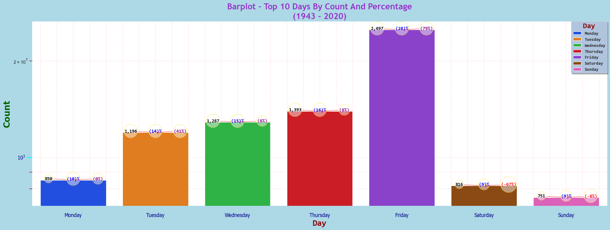
*Generated using seaborn library*

### General Overview:


### Key Insights & Interpretations:

**I:** Friday has the highest content count at 28.41%, indicating it’s the most active day for releases.

**II:** Saturday and Sunday see the lowest counts, suggesting reduced content activity on weekends.


### Trends & Implications:

**I:** The gradual increase from Monday to Thursday suggests a buildup towards Friday’s peak.

**II:** The sharp drop after Friday implies a strategic pause in releases over the weekend.


### Actionable Takeaways:

**I:** Netflix could explore increasing weekend releases to balance engagement throughout the week.

**II:** Further analysis could determine if content released on specific days performs better in viewership.


### 6. 🔢The Count, 💯Percentage, ⏳Previous Count, 📈📉Percentage Change & 🏅Count Rank Of The Top 10 Months[.sql](6_Top_10_Months.sql)
To identify the Count, Percentage, Previous Count, Percentage Change & Count Rank the following functions were used: `COUNT`, `GROUP BY`, `LAG` and `DENSE_RANK`.

*This query highlights The Top 10 Months.*

```sql
WITH release_months AS (
    SELECT
        EXTRACT(MONTH FROM date_added) AS month_number,
        TO_CHAR(date_added, 'Month') AS month,
        COUNT(*) AS count --(*) counts all rows in a table, including rows with NULL values.
    FROM 
        netflix_data
    --WHERE
        --type
        --AND
        --director
        --AND
        --country
    GROUP BY 
        month_number,
        month
),
top_10 AS (
    SELECT
        month_number,
        month,
        count
    FROM 
        release_months
    ORDER BY 
        count DESC
    LIMIT 10
)
SELECT
    month,
    --month_number,
    count,
    ROUND((count * 100.0) / SUM(count) OVER (), 2) AS percentage,
    COALESCE(LAG(count) OVER (ORDER BY month_number ASC), 0) AS prev_count,  -- Replacing NULL with 0,
    CASE 
        WHEN LAG(count) OVER (ORDER BY month_number) IS NOT NULL 
        THEN ROUND(((count - LAG(count) OVER (ORDER BY month_number ASC)) * 100.0) / LAG(count) OVER (ORDER BY month_number ASC), 2)
        ELSE 0
    END AS percentage_change,
    RANK() OVER (ORDER BY count DESC) AS count_rank
FROM 
    top_10
ORDER BY 
    month_number ASC;
```

### Dataframe
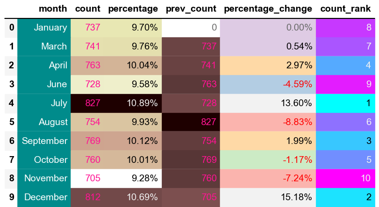
*Generated using pandas library*

### Bar Plot
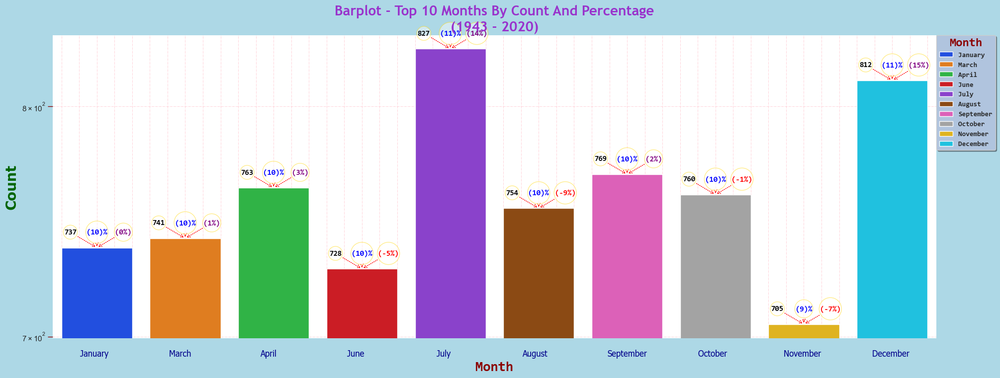
*Generated using seaborn library*

### General Overview:


### Key Insights & Interpretations:

**I:** July had the highest count (827), indicating a peak in activity, while November had the lowest (705).

**II:** December saw a notable 15.18% increase from November, suggesting a seasonal rise in content.

**III:** August experienced the biggest drop (-8.83%), potentially signaling a post-summer decline.


### Trends & Implications:

**I:** The fluctuations suggest potential seasonality, with content peaking mid-year and towards the end of the year.

**II:** The decline from August to November might indicate a slowdown before a holiday surge in December.


### Actionable Takeaways:

**I:** Investigate factors contributing to July and December spikes to leverage content strategy.

**II:** Explore the causes behind the August to November drop to mitigate future declines.

**III:** Consider aligning releases with peak months to maximise engagement.


### 7. 🔢The Count, 💯Percentage, ⏳Previous Count, 📈📉Percentage Change & 🏅Count Rank Of The Top 10 Quarters[.sql](7_Top_10_Quarters.sql)
To identify the Count, Percentage, Previous Count, Percentage Change & Count Rank the following functions were used: `COUNT`, `GROUP BY`, `LAG` and `DENSE_RANK`.

*This query highlights The Top 10 Quarters.*

```sql
WITH release_quarters AS (
    SELECT
        EXTRACT(QUARTER FROM date_added) AS quarter_number,
        CONCAT('Q', EXTRACT(QUARTER FROM date_added)) AS quarter,
        COUNT(*) AS count --(*) counts all rows in a table, including rows with NULL values.
    FROM 
        netflix_data
    --WHERE
        --type
        --AND
        --director
        --AND
        --country
    GROUP BY 
        quarter_number,
        quarter
),
top_10 AS (
    SELECT
        quarter_number,
        quarter,
        count
    FROM 
        release_quarters
    ORDER BY 
        count DESC
    LIMIT 10
)
SELECT
    quarter,
    --quarter_number,
    count,
    ROUND((count * 100.0) / SUM(count) OVER (), 2) AS percentage,
    COALESCE(LAG(count) OVER (ORDER BY quarter_number ASC), 0) AS prev_count,  -- Replacing NULL with 0,
    CASE 
        WHEN LAG(count) OVER (ORDER BY quarter_number ASC) IS NOT NULL 
        THEN ROUND(((count - LAG(count) OVER (ORDER BY quarter_number ASC)) * 100.0) / LAG(count) OVER (ORDER BY quarter_number ASC), 2)
        ELSE 0
    END AS percentage_change,
    DENSE_RANK() OVER (ORDER BY count DESC) AS count_rank
FROM 
    top_10
ORDER BY 
    quarter_number ASC;
```

### Dataframe
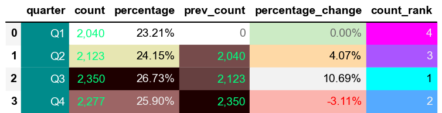
*Generated using pandas library*

### Bar Plot
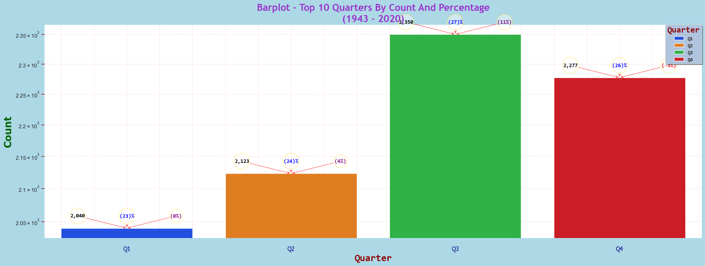
*Generated using seaborn library*

### Line Plot
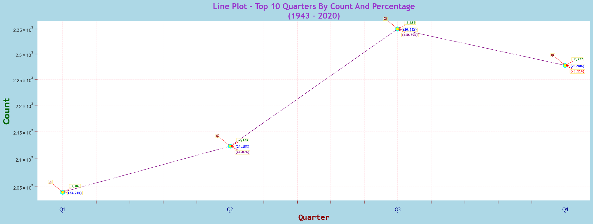
*Generated using seaborn library*

### General Overview:


### Key Insights & Interpretations:

**I:** Q3 had the highest count (2,350), marking the peak period of activity.

**II:** Q4 saw a slight decline (-3.11%), indicating a drop-off after the Q3 peak.

**III:** The strongest growth occurred from Q2 to Q3 (10.69%), highlighting a mid-year surge.


### Trends & Implications:

**I:** The increasing trend from Q1 to Q3 suggests a buildup towards peak content periods.

**II:** The slight dip in Q4 might indicate seasonal fluctuations or shifting priorities.


### Actionable Takeaways:

**I:** Capitalise on the Q3 surge by aligning major releases or promotions during this period.

**II:** Investigate potential reasons for the Q4 drop to mitigate future declines.

**III:** Analyse Q1’s performance to identify early-year opportunities for engagement.


### 8. 🔢The Count, 💯Percentage, ⏳Previous Count, 📈📉Percentage Change & 🏅Count Rank Of The Top 10 Release Years[.sql](8_Top_10_Release_Years.sql)
To identify the Count, Percentage, Previous Count, Percentage Change & Count Rank the following functions were used: `COUNT`, `GROUP BY`, `LAG` and `DENSE_RANK`.

*This query highlights The Top 10 Release Years.*

```sql
WITH release_years AS (
    SELECT
        release_year,
        COUNT(release_year) AS count --(*) counts all rows in a table, including rows with NULL values.
    FROM 
        netflix_data
    --WHERE
        --type
        --AND
        --director
        --AND
        --country
    GROUP BY 
        release_year
),
top_10 AS (
    SELECT
        release_year,
        count
    FROM 
        release_years
    ORDER BY 
        count DESC
    LIMIT 10
)
SELECT
    release_year,
    count,
    ROUND((count * 100.0) / SUM(count) OVER (), 2) AS percentage,
    COALESCE(LAG(count) OVER (ORDER BY release_year ASC), 0) AS prev_count,  -- Replacing NULL with 0,
    CASE 
        WHEN LAG(count) OVER (ORDER BY release_year ASC) IS NOT NULL 
        THEN ROUND(((count - LAG(count) OVER (ORDER BY release_year ASC)) * 100.0) / LAG(count) OVER (ORDER BY release_year ASC), 2)
        ELSE 0
    END AS percentage_change,
    DENSE_RANK() OVER (ORDER BY count DESC) AS count_rank
FROM 
    top_10
ORDER BY 
    release_year;
```

### Dataframe
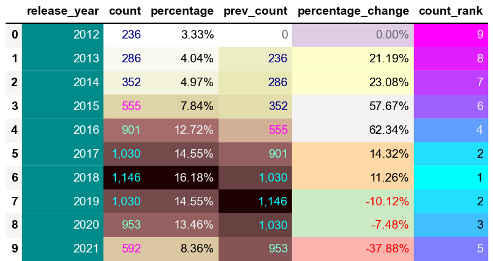
*Generated using pandas library*

### Bar Plot
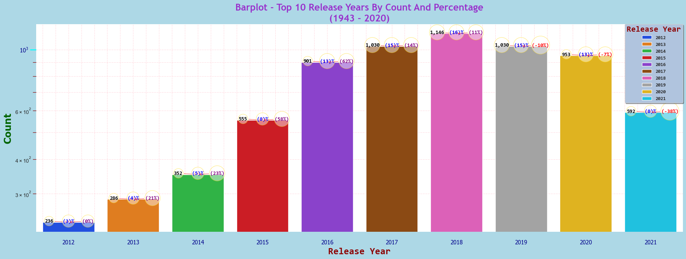
*Generated using seaborn library*

### Line Plot
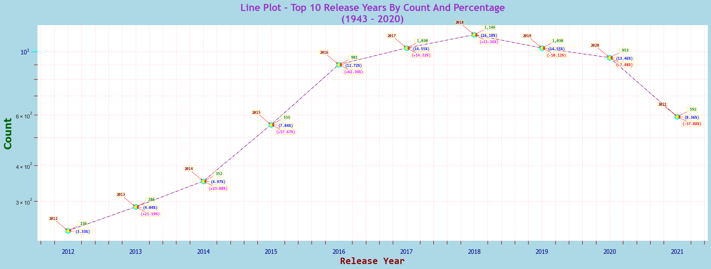
*Generated using seaborn library*

### General Overview:


### Key Insights & Interpretations:

**I:** The data shows a steady increase in counts from 2012 to 2018, peaking in 2018.

**II:** This growth suggests increased demand or production capacity during these years.

**III:** The sharp decline after 2018 highlights a significant shift that needs further investigation.


### Trends & Implications:

**I:** The upward trend until 2018 implies strong market performance and growth opportunities.

**II:** The decline from 2019 onwards could indicate market saturation or increased competition.

**III:** Understanding these trends is crucial for forecasting and strategic decision-making.


### Actionable Takeaways:

**I:** Conduct a detailed analysis of factors contributing to the decline post-2018.

**II:** Explore diversification or new market opportunities to counteract the downward trend.

**III:** Strengthen competitive strategies and consider external factors impacting growth.


### 9. 🔢The Count, 💯Percentage, ⏳Previous Count, 📈📉Percentage Change & 🏅Count Rank Of The Top 10 Release Years And Quarters[.sql](9_Top_10_Release_Years_And_Quarters.sql)
To identify the Count, Percentage, Previous Count, Percentage Change & Count Rank the following functions were used: `COUNT`, `GROUP BY`, `LAG` and `DENSE_RANK`.

*This query highlights The Top 10 Release Years And Quarters.*

```sql
WITH release_years_and_quarters AS (
    SELECT
        release_year,
        EXTRACT(QUARTER FROM date_added) AS quarter_number,
        CONCAT('Q', EXTRACT(QUARTER FROM date_added)) AS quarter,
        COUNT(*) AS count --(*) counts all rows in a table, including rows with NULL values.
    FROM 
        netflix_data
    --WHERE
        --type
        --AND
        --director
        --AND
        --country
    GROUP BY 
        release_year,
        quarter_number,
        quarter
),
top_10 AS (
    SELECT
        release_year,
        quarter_number,
        quarter,
        count
    FROM 
        release_years_and_quarters
    ORDER BY 
        count DESC
    LIMIT 10
)
SELECT
    release_year,
    quarter,
    --quarter_number,
    count,
    ROUND((count * 100.0) / SUM(count) OVER (), 2) AS percentage,
    COALESCE(LAG(count) OVER (ORDER BY release_year ASC), 0) AS prev_count,  -- Replacing NULL with 0,
    CASE 
        WHEN LAG(count) OVER (ORDER BY quarter_number ASC) IS NOT NULL 
        THEN ROUND(((count - LAG(count) OVER (ORDER BY release_year ASC)) * 100.0) / LAG(count) OVER (ORDER BY release_year ASC), 2)
        ELSE 0
    END AS percentage_change,
    DENSE_RANK() OVER (ORDER BY count DESC) AS count_rank
FROM 
    top_10
ORDER BY 
    release_year ASC,
    quarter ASC
```

### Dataframe
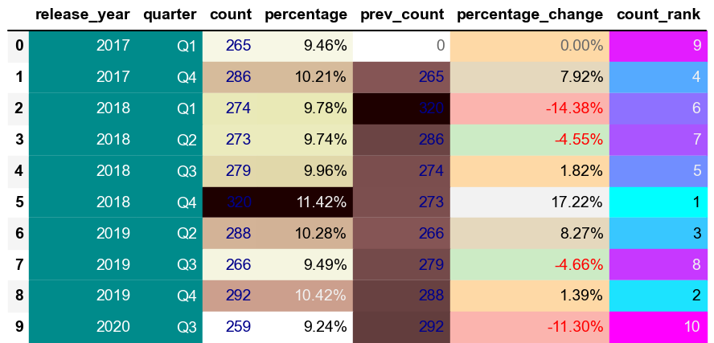
*Generated using pandas library*

### Heatmap
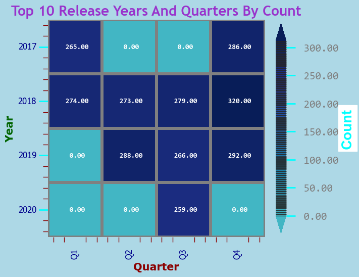
*Generated using seaborn library*

### General Overview:


### Key Insights & Interpretations:

**I:** The highest count occurs in Q4 2018, indicating a peak in activity or demand during this period.

**II:** There is a noticeable fluctuation in counts across quarters, suggesting seasonal or cyclical variations.

**III:** The decline in Q1 2018 and Q3 2019 highlights potential challenges or changes in market conditions.


### Trends & Implications:

**I:** The data shows a general pattern of higher counts in Q4, possibly due to end-of-year activities or increased demand.

**II:** Fluctuations suggest that external factors or market dynamics significantly impact quarterly performance.

**III:** Understanding these trends can help in planning and optimising resource allocation throughout the year.


### Actionable Takeaways:

**I:** Investigate the factors contributing to the peak in Q4 2018 to replicate success in future quarters.

**II:** Analyse the causes of declines in specific quarters to mitigate risks and improve stability.

**III:** Develop strategies to capitalise on high-performing quarters and address challenges in weaker periods.


### 10. 🔢The Count, 💯Percentage, ⏳Previous Count, 📈📉Percentage Change & 🏅Count Rank Of The Top 10 Ratings[.sql](10_Top_10_Ratings.sql)
To identify the Count, Percentage, Previous Count, Percentage Change & Count Rank the following functions were used: `COUNT`, `GROUP BY`, `LAG` and `DENSE_RANK`.

*This query highlights The Top 10 Ratings.*

```sql
WITH ratings AS (
    SELECT
        rating,
        COUNT(rating) AS count --(*) counts all rows in a table, including rows with NULL values.
        --TO_CHAR(ROUND(rating, 0),'FM999,999,999') AS formatted_count
    FROM 
        netflix_data
    --WHERE 
        --EXTRACT(QUARTER FROM date_added) IN (1, 2, 3, 4)
    GROUP BY 
        rating
),
top_10 AS (
    SELECT
        rating,
        count
    FROM 
        ratings
    ORDER BY 
        count DESC
    LIMIT 10
)
SELECT
    rating,
    count,
    ROUND((count * 100.0) / SUM(count) OVER (), 2) AS percentage,
    COALESCE(LAG(count) OVER (ORDER BY count DESC), 0) AS prev_count, -- Replacing NULL with 0,
    CASE 
        WHEN LAG(count) OVER (ORDER BY count DESC) IS NOT NULL 
        THEN ROUND(((count - LAG(count) OVER (ORDER BY count DESC)) * 100.0) / LAG(count) OVER (ORDER BY count DESC), 2)
        ELSE 0
    END AS percentage_change,
    DENSE_RANK() OVER (ORDER BY count DESC) AS count_rank   
FROM 
    top_10;
--ORDER BY 
    --count DESC
```

### Dataframe
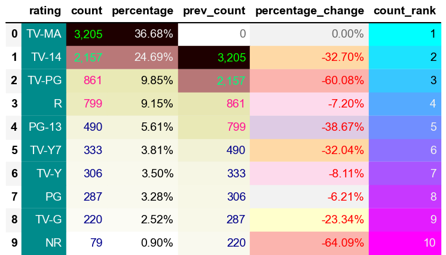
*Generated using pandas library*

### Pie Chart
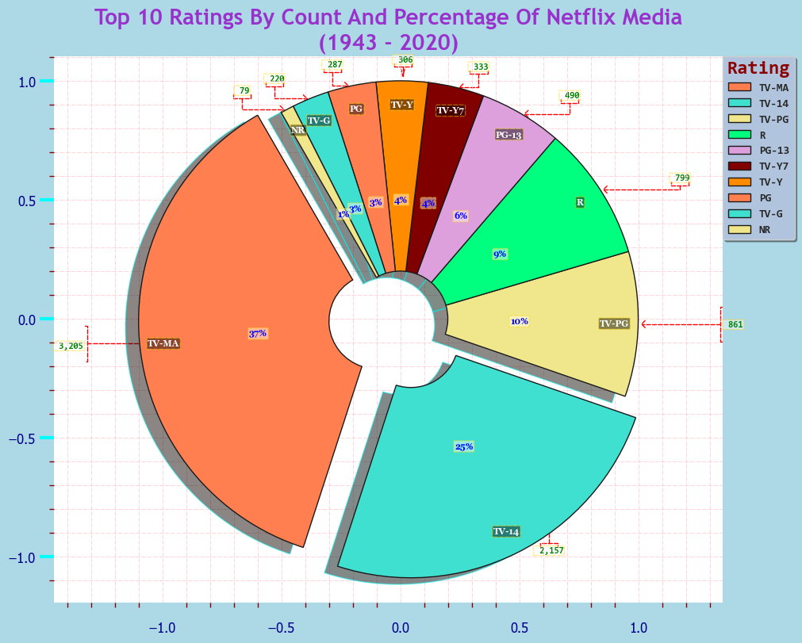
*Generated using seaborn library*

### Bar Plot
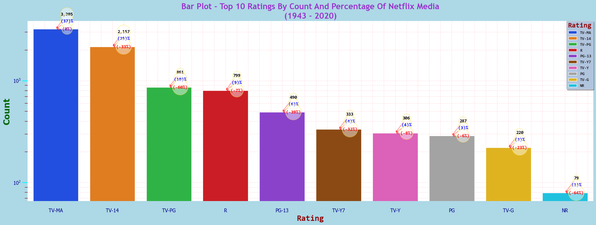
*Generated using seaborn library*

### General Overview:


### Key Insights & Interpretations:

**I:** TV-MA has the highest count, indicating a strong preference or demand for mature content.

**II:** There is a significant drop in counts from TV-MA to TV-14, suggesting a steep decline in content for younger audiences.

**III:** The lowest counts are for TV-G and NR, indicating limited content availability or demand in these categories.


### Trends & Implications:

**I:** The data suggests a trend towards more mature content, with TV-MA and TV-14 dominating the counts.

**II:** The sharp percentage decrease in TV-PG and PG-13 indicates a potential shift away from family-oriented content.

**III:** Understanding these trends can help in content planning and targeting specific audience segments effectively.


### Actionable Takeaways:

**I:** Focus on expanding TV-MA content to capitalise on its high demand and popularity.

**II:** Investigate the reasons behind the decline in TV-PG and PG-13 to address potential gaps in the market.

**III:** Consider strategies to diversify content offerings, especially in underrepresented categories like TV-G and NR.


### 11. 🔢The Count, 💯Percentage, ⏳Previous Count, 📈📉Percentage Change & 🏅Count Rank Of The Top 10 Countries[.sql](11_Top_10_Countries.sql)
To identify the Count, Percentage, Previous Count, Percentage Change & Count Rank the following functions were used: `COUNT`, `GROUP BY`, `LAG` and `DENSE_RANK`.

*This query highlights The Top 10 Countries.*

```sql
WITH countries AS (
    SELECT
        country,
        COUNT(country) AS count --(*) counts all rows in a table, including rows with NULL values.
        --TO_CHAR(ROUND(country, 0),'FM999,999,999') AS formatted_count
    FROM 
        netflix_data
    WHERE
        country NOT IN ('Not Given') -- <> '' can be used too
        --EXTRACT(QUARTER FROM date_added) IN (1, 2, 3, 4)
    GROUP BY 
        country
),
top_10 AS (
    SELECT
        country,
        count
    FROM 
        countries
    ORDER BY 
        count DESC
    LIMIT 10
)
SELECT
    country,
    count,
    ROUND((count * 100.0) / SUM(count) OVER (), 2) AS percentage,
    COALESCE(LAG(count) OVER (ORDER BY count DESC), 0) AS prev_count, -- Replacing NULL with 0,
    CASE 
        WHEN LAG(count) OVER (ORDER BY count DESC) IS NOT NULL 
        THEN ROUND(((count - LAG(count) OVER (ORDER BY count DESC)) * 100.0) / LAG(count) OVER (ORDER BY count DESC), 2)
        ELSE 0
    END AS percentage_change,
    DENSE_RANK() OVER (ORDER BY count DESC) AS count_rank
    
FROM 
    top_10;
--ORDER BY 
    --count DESC
```

### Dataframe
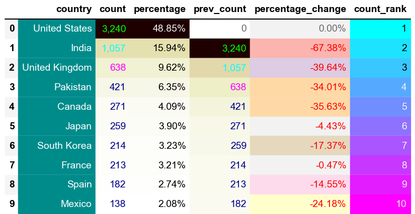
*Generated using pandas library*

### Bar Plot
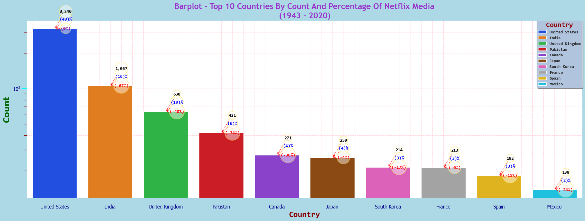
*Generated using seaborn library*

### General Overview:


### Key Insights & Interpretations:

**I:** The United States leads with nearly half of the total count, indicating a dominant presence.

**II:** India and the United Kingdom follow, but with significantly lower counts, highlighting a concentration of content in the U.S.

**III:** The steep percentage decrease from India to the United Kingdom suggests a sharp drop in content production or availability.


### Trends & Implications:

**I:** The data shows a strong U.S. dominance, which may influence global content trends and preferences.

**II:** The decline in counts for other countries suggests potential challenges in content production or distribution.

**III:** Understanding these trends can help identify opportunities for growth in underrepresented markets.


### Actionable Takeaways:

**I:** Explore strategies to increase content production in countries with lower counts to diversify offerings.

**II:** Investigate the factors contributing to the U.S.'s dominance to replicate success in other regions.

**III:** Consider partnerships or collaborations in countries with declining counts to boost content availability.


### 12. 🔢The Count, 💯Percentage, ⏳Previous Count, 📈📉Percentage Change & 🏅Count Rank Of The Top 10 Countries By Movie Count[.sql](12_Top_10_Countries_By_Movie_Count.sql)
To identify the Count, Percentage, Previous Count, Percentage Change & Count Rank the following functions were used: `COUNT`, `GROUP BY`, `LAG` and `DENSE_RANK`.

*This query highlights The Top 10 Countries By Movie Count.*

```sql
WITH countries_movie AS (
    SELECT
        country,
        COUNT(country) AS count --(*) counts all rows in a table, including rows with NULL values.
        --TO_CHAR(ROUND(country, 0),'FM999,999,999') AS formatted_count
    FROM 
        netflix_data
    WHERE
        country NOT IN ('Not Given') -- <> '' can be used too
        AND
        type IN ('Movie')
        --EXTRACT(QUARTER FROM date_added) IN (1, 2, 3, 4)
    GROUP BY 
        country
),
top_10 AS (
    SELECT
        country,
        count
    FROM 
        countries_movie
    ORDER BY 
        count DESC
    LIMIT 10
)
SELECT
    country,
    count,
    ROUND((count * 100.0) / SUM(count) OVER (), 2) AS percentage,
    COALESCE(LAG(count) OVER (ORDER BY count DESC), 0) AS prev_count, -- Replacing NULL with 0,
    CASE 
        WHEN LAG(count) OVER (ORDER BY count DESC) IS NOT NULL 
        THEN ROUND(((count - LAG(count) OVER (ORDER BY count DESC)) * 100.0) / LAG(count) OVER (ORDER BY count DESC), 2)
        ELSE 0
    END AS percentage_change,
    DENSE_RANK() OVER (ORDER BY count DESC) AS count_rank
    
FROM 
    top_10;
--ORDER BY 
    --count DESC
```

### Dataframe
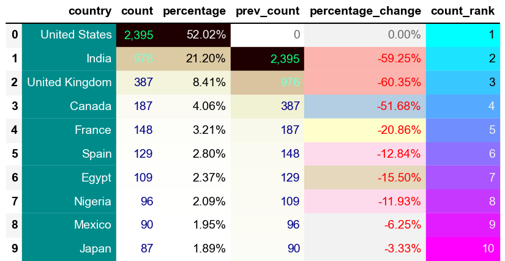
*Generated using pandas library*

### Bar Plot
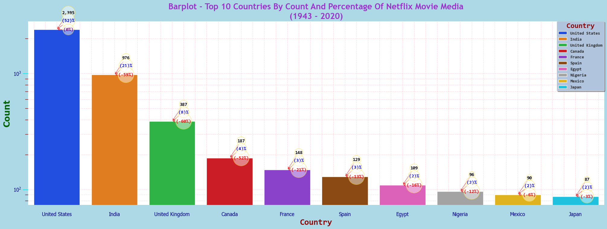
*Generated using seaborn library*

### General Overview:


### Key Insights & Interpretations:

**I:** The United States accounts for over half of the total count, indicating a strong dominance in content production.

**II:** India and the United Kingdom follow, but with significantly lower counts, highlighting a concentration of content in the U.S.

**III:** The sharp percentage decrease from India to the United Kingdom suggests a steep drop in content availability or production.


### Trends & Implications:

**I:** The data reflects a strong U.S. influence, which may shape global content trends and audience preferences.

**II:** The decline in counts for other countries suggests potential barriers in content production or distribution.

**III:** Recognising these trends can help identify growth opportunities in less represented markets.


### Actionable Takeaways:

**I:** Develop strategies to boost content production in countries with lower counts to diversify offerings.

**II:** Investigate the factors contributing to the U.S.'s dominance to replicate success in other regions.

**III:** Consider partnerships or collaborations in countries with declining counts to enhance content availability.


### 13. 🔢The Count, 💯Percentage, ⏳Previous Count, 📈📉Percentage Change & 🏅Count Rank Of The Top 10 Countries By TV Show Count[.sql](13_Top_10_Countries_By_TV_Show_Count.sql)
To identify the Count, Percentage, Previous Count, Percentage Change & Count Rank the following functions were used: `COUNT`, `GROUP BY`, `LAG` and `DENSE_RANK`.

*This query highlights The Top 10 Countries By TV Show Count.*

```sql
WITH countries_tv AS (
    SELECT
        country,
        COUNT(country) AS count --(*) counts all rows in a table, including rows with NULL values.
        --TO_CHAR(ROUND(country, 0),'FM999,999,999') AS formatted_count
    FROM 
        netflix_data
    WHERE
        country NOT IN ('Not Given') -- <> '' can be used too
        AND
        type IN ('TV Show')
        --EXTRACT(QUARTER FROM date_added) IN (1, 2, 3, 4)
    GROUP BY 
        country
),
top_10 AS (
    SELECT
        country,
        count
    FROM 
        countries_tv
    ORDER BY 
        count DESC
    LIMIT 10
)
SELECT
    country,
    count,
    ROUND((count * 100.0) / SUM(count) OVER (), 2) AS percentage,
    COALESCE(LAG(count) OVER (ORDER BY count DESC), 0) AS prev_count, -- Replacing NULL with 0,
    CASE 
        WHEN LAG(count) OVER (ORDER BY count DESC) IS NOT NULL 
        THEN ROUND(((count - LAG(count) OVER (ORDER BY count DESC)) * 100.0) / LAG(count) OVER (ORDER BY count DESC), 2)
        ELSE 0
    END AS percentage_change,
    DENSE_RANK() OVER (ORDER BY count DESC) AS count_rank
    
FROM 
    top_10;
--ORDER BY 
    --count DESC
```

### Dataframe
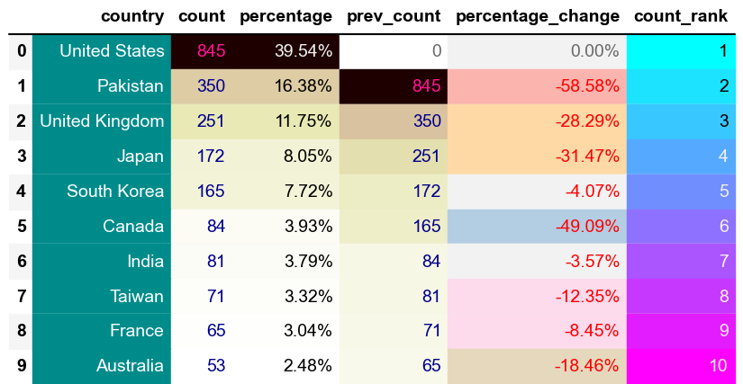
*Generated using pandas library*

### Bar Plot
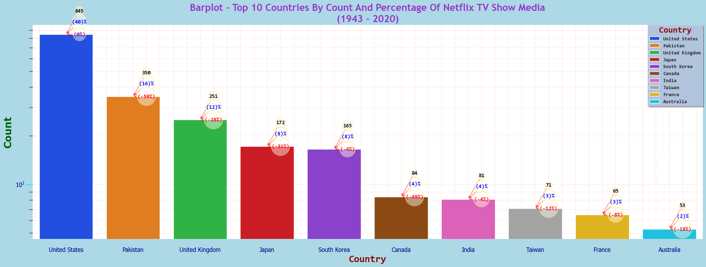
*Generated using seaborn library*

### General Overview:


### Key Insights & Interpretations:

**I:** The United States leads with the highest count, indicating a dominant role in content production.

**II:** Pakistan and the United Kingdom follow, but with significantly lower counts, showing a concentration of content in the U.S.

**III:** The percentage decrease from Pakistan to the United Kingdom suggests a notable drop in content availability.


### Trends & Implications:

**I:** The data highlights a strong U.S. influence, potentially shaping global content trends and audience preferences.

**II:** The decline in counts for other countries suggests challenges in content production or distribution.

**III:** Recognising these trends can help identify opportunities for growth in less represented markets.


### Actionable Takeaways:

**I:** Develop strategies to increase content production in countries with lower counts to diversify offerings.

**II:** Investigate the factors contributing to the U.S.'s dominance to replicate success in other regions.

**III:** Consider partnerships or collaborations in countries with declining counts to enhance content availability.


# What I Learned

Throughout this adventure, I've turbocharged my SQL toolkit with some serious firepower:

- **🧩 Complex Query Crafting:** Mastered the art of advanced SQL, merging tables like a pro and wielding `WITH` clauses for ninja-level temp table manoeuvres.
- **📊 Data Aggregation:** Got cozy with `GROUP BY` and turned aggregate functions like `COUNT()` and `AVG()` into my data-summarising sidekicks.
- **💡Analystical Wizardry:** Leveled up my real-world puzzle solving skills, turning questions into actionable, insightful SQL queries.

# Conclusions


### Insights
From the analysis, several insights emerged:

1. **TBC:** TBC.
2. **TBC:** TBC.
3. **TBC:** TBC.
4. **TBC:** TBC.
5. **TBC:** TBC.


### Closing Thoughts
TBC..
